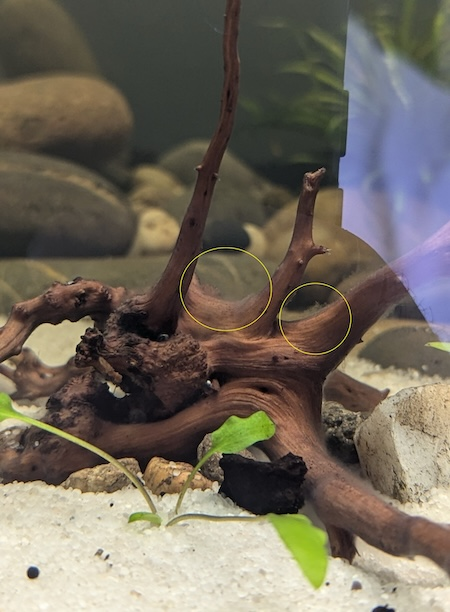

# Recordings

## 2024-08-13

- Plant leaves started showing some decay and some algae are starting to bloom - plants lack nutrients. Got the following supplements from the fish shop:
  - Iron
  - Phosphate
  - Nitrogen

Also got KH/GH/CO2 tests to ensure my levels are OK. Also got a product called [Dymax Clear Mix](https://mydymax.com/products/dymax-clear-mix?_pos=1&_sid=a1a01caa8&_ss=r) which can absorb the impurities - have to put it under the fine wool so I'm yet to do that.

Did a water change (only about 10/15%) and that cleared things up a bit.

The CO2 measure is in the water and looks green enough, I guess I have enough CO2 but I'm thinking of lowering the light a bit more for the plants to benefit from it. We'll see.

All nutrients from plants are from `aquavitro`:

- [propel (Fe)](https://www.aquavitro.com/propel.php)
- [activate (P)](https://www.aquavitro.com/activate.php)
- [synthesis (N)](https://www.aquavitro.com/synthesis.php)

Which I fed:

- `Fe` -> 5 mL
- `P` -> 3 mL
- `N` -> 3 mL

## 2024-08-11

- Planted Blyxa Japonicas, Crypts, Anubias and Banana Lily (plus another one I don't remember)
- Had to get an O-ring for my CO2 solenoid as the one I had dried out
- Hooked it all up and put
  - a bit of tap conditioner
  - a bit of fluoride

Tank water is green/brown which is quite unpleasant. Probably due to driftwood. It will clear up but need time.

Setup the light schedule to be two sessions of 3 hours.
