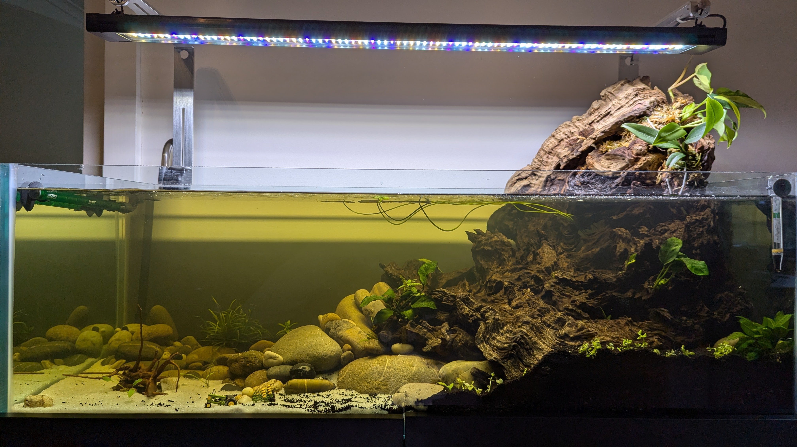

# Aquarium Log

An account of setting up a new tropical fish tank with external plants, CO2, etc

## Current status

- CO2 bubbling at about 2 bubbles per second
- Heater at 27 C
- Aqua One canister filter with UV

