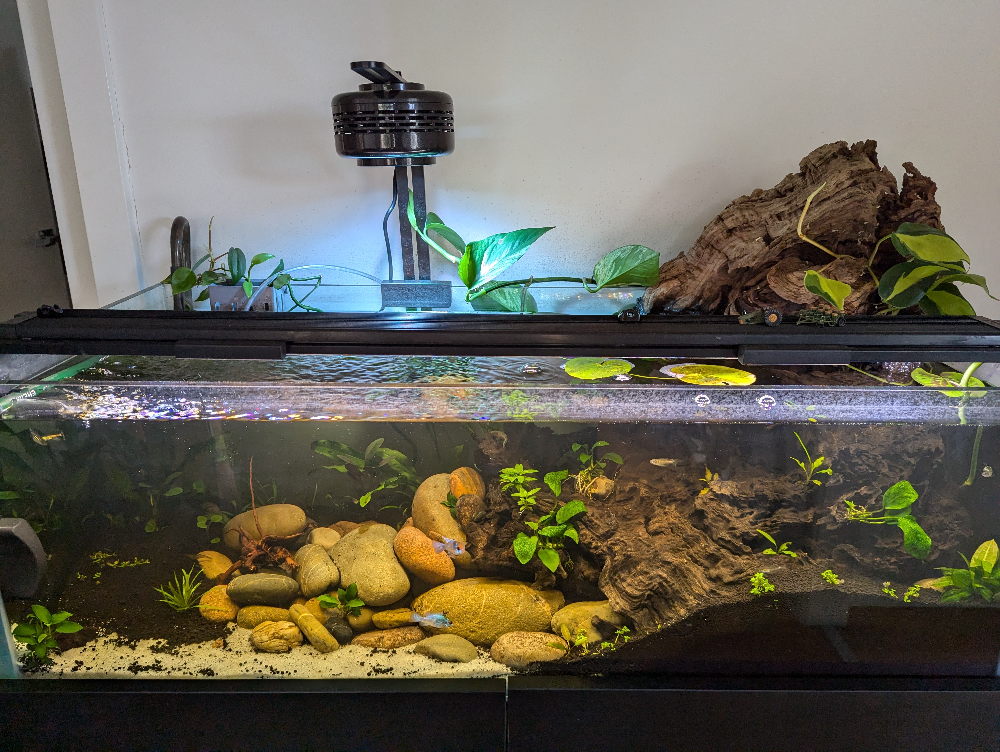

# Aquarium Log

An account of setting up a new tropical fish tank with external plants, CO2, etc

## Current status

- CO2 disabled (before was 1 bubble every 2 seconds and before that 2 bubbles per second)
- Heater at 26 C
- Aqua One canister filter with UV
  - extra media at the bottom (not in the baskets)
  - extra fine wool layer at the bottom
  - no purigen/dymax
- Added some decorations / gravel from the other tank into it to aid the good bacteria development
- Added an air stone
- Stopped dosing

## Calculators

- [Dosage calculator](https://docs.google.com/spreadsheets/d/1_vBNEu3wStDuWqnCudZdVtwjAx2mr94I-8yxgz4mpK8/edit?gid=0#gid=0)
- [Light calculator](https://docs.google.com/spreadsheets/d/1IrqIBygd8MKEA3pOYLY1BDArz8S-sklm/edit?gid=811352064#gid=811352064)

## Diary

- [August 2024](2024/08_august.md)
- [September 2024](2024/09_september.md)

## Major learnings so far

- Put a layer of substrate first. This will help create a bed for both plants and hard decorations.
- Wash or boil your wood before putting in the tank. New wood will release tannin and this can take a long time to get rid of - plus money.
- Aerate your water. If you have a spray bar, that works best: position it above the water level and let it do its thing.
  - I have a drop checker that is constantly light green: this means too much CO2 in the water and the fact that was still green 18 hours after I stopped pumping CO2 into the tank is a warning that something is not right.
  - By aerating the water it helps break the water surface tension thus creating more oxygen and allowing for better gas exchange between water and air.
- Fertilize your plants straight away. I got the stuff I was recommended by my LFS but am not monitoring as I'm trying to look at **ammonia** and **nitrite** development throughout the cycle. Some plants are suffering a bit but that's OK I don't think they will starve and completely die anymore.
  - [update Aug 19th] Should have measured, now I have a bio bloom :unamused:
- Get your lights right: in LEDs the watts don't matter as much so it's important to look at lumens. Getting your info right using the [light calculator](https://docs.google.com/spreadsheets/d/1IrqIBygd8MKEA3pOYLY1BDArz8S-sklm/edit?gid=811352064#gid=811352064) will help you decide how much you need and how far from the substrate you need them.
- Bio bloom is a thing: go easy on the nutrients and take it slowly. My tank got so dark that's hard to see the back wall.
